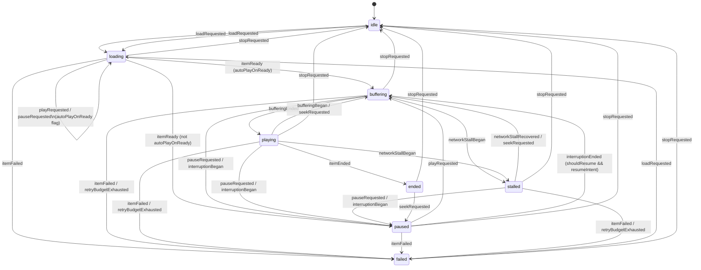

# AudioStreamKit V1 — Playback State Machine

Status: Accepted (2026-09-11).
Detail behind the `PlaybackStateMachine` box in `high-level-architecture.md`.
Satisfies FR4, FR8, FR10, FR11 in `v1-requirements.md`.

## 1. Design goals

- Pure logic: no I/O, no AVFoundation, no `Foundation` networking types —
  takes typed events, returns a new state. Fully unit-testable per NFR11
  without real network or hardware.
- Tolerant of stale/racy events. AVFoundation delivers state via KVO and
  `NotificationCenter` on arbitrary queues; a command (e.g. `stop()`) and
  an in-flight callback (e.g. a late `itemReady`) can race. An event that
  doesn't apply to the current state must be a safe no-op, never a crash
  or an assertion failure.
- Single-threaded by construction: `PlaybackStateMachine` is not itself an
  actor. Its only caller is `PlaybackEngine`, which *is* an actor — every
  call into the state machine is already serialized by that actor's
  isolation, so the machine itself can be a plain value/reference type.
  (NFR6 is satisfied at the `PlaybackEngine` boundary, not by the machine
  duplicating isolation.)

## 2. Public states (`PlaybackState`)

The 8 states from FR4, plus the associated data each needs:

```swift
enum PlaybackState: Equatable {
    case idle
    case loading
    case buffering
    case playing
    case paused
    case stalled
    case failed(PlaybackError)
    case ended
}
```

`PlaybackError` is an opaque associated type here — its taxonomy (bad URL,
HTTP error, decode failure, unsupported format, per FR12) is scoped to the
error-handling-strategy topic, still open per the dev log.

### `buffering` vs `stalled` — the FR11 distinction

These are **not** the same "not playing" signal at two severities. They
have different causes and different sources of truth, which is what makes
them distinguishable at all:

- **`buffering`** — benign, expected data-not-ready-yet: the initial fill
  after `load()`, or the re-fill after a `seek()`. Reported by
  `PlaybackEngine` from AVPlayer's own buffering signal
  (`timeControlStatus == .waitingToPlayAtSpecifiedRate`). No error, no
  retry in progress.
- **`stalled`** — specifically: `MediaSource` detected a transient
  failure on a byte-range fetch and `RetryPolicy` is actively retrying it
  (FR10, `streaming-and-caching.md` §6). Reported by `PlaybackEngine` from
  the `MediaSource` layer, not from AVPlayer's generic buffering signal.

`PlaybackEngine` knows which one occurred because it owns both signal
sources — the state machine doesn't infer or guess; it's told directly via
distinct events (`.bufferingBegan` vs `.networkStallBegan`). This keeps the
machine itself trivial and keeps the interesting classification logic
sitting next to the data it depends on.

## 3. Events (`PlaybackEvent`)

```swift
enum PlaybackEvent {
    // Commands — from AudioPlayer's public API
    case loadRequested
    case playRequested
    case pauseRequested
    case stopRequested
    case seekRequested

    // Engine-reported — from AVFoundation / MediaSource
    case itemReady
    case bufferingBegan
    case bufferingEnded          // buffer sufficient; audio is flowing
    case networkStallBegan
    case networkStallRecovered
    case retryBudgetExhausted(PlaybackError)
    case itemFailed(PlaybackError)
    case itemEnded
    case interruptionBegan
    case interruptionEnded(shouldResume: Bool)
}
```

Notes:

- No separate `.playbackStarted` event. Resuming from `paused` always
  routes through `.buffering` → `.bufferingEnded` rather than jumping
  straight to `.playing`, even when the buffer is already full. In
  practice `PlaybackEngine` can emit `.bufferingEnded` on the same run
  loop turn when nothing actually needs to be fetched, so there's no
  visible flicker — but it keeps the model to a single path into
  `.playing`, instead of two.
- `.interruptionEnded(shouldResume:)` carries the **system's** signal
  (`AVAudioSession.InterruptionOptions.contains(.shouldResume)`). The
  machine ANDs this with its own memory of whether *this app* was
  actively playing immediately before the interruption (FR8's actual
  policy, app-level, not system-level). Both must be true to auto-resume.
  This reuses the event shape already sketched in
  `high-level-architecture.md` rather than replacing it — the app-level
  memory lives entirely inside the state machine (see §5), so the
  combined decision stays pure and testable without a real
  `AVAudioSession`.

## 4. Global rules (apply from any state)

- **`.loadRequested`** — always legal, from any state including
  `.failed` and `.ended`. Tears down whatever session is active and moves
  to `.loading`. This is the mechanism behind FR13 ("replacing the current
  item cleanly releases all resources") — replacing an item is just
  `load()` again; there's no separate "replace" event.
- **`.stopRequested`** — legal from any non-`.idle` state, always goes to
  `.idle`. Idempotent no-op from `.idle`.
- **`.itemFailed`** / **`.retryBudgetExhausted`** — legal from any
  non-terminal state (`.loading`, `.buffering`, `.playing`, `.paused`,
  `.stalled`), always goes to `.failed(error)`.
- Any event not explicitly listed for the current state in §5 is
  **ignored**: the machine returns unchanged state, no side effects. This
  is the "tolerate stale events" rule from §1, applied uniformly.

## 5. Per-state transitions

Two kinds of "no visible change" outcome are worth distinguishing when
reading this table:

- **ignored** — the event is irrelevant or stale in this state; nothing
  about the machine's memory changes either.
- **self-transition** — the visible state doesn't change, but internal
  memory does (e.g. recording play-intent while still loading). Still a
  "legal transition" in the FR4 sense, just not an externally visible one.

### `idle`
| Event | Result |
|---|---|
| `.loadRequested` | → `.loading` |
| anything else | ignored |

### `.loading`
Tracks an internal `autoPlayOnReady: Bool` (default `false`).

| Event | Result |
|---|---|
| `.playRequested` | self-transition; `autoPlayOnReady = true` |
| `.pauseRequested` | self-transition; `autoPlayOnReady = false` |
| `.itemReady` | → `.buffering` if `autoPlayOnReady`, else → `.paused` |
| `.itemFailed` | → `.failed` |
| anything else | ignored |

(`.seekRequested` is ignored here — no known duration/position yet.)

### `.buffering`
| Event | Result |
|---|---|
| `.bufferingEnded` | → `.playing` |
| `.networkStallBegan` | → `.stalled` |
| `.pauseRequested` | → `.paused` |
| `.seekRequested` | self-transition (new seek supersedes the current wait) |
| `.interruptionBegan` | → `.paused`; record resumeIntent = **true** |
| `.playRequested` | ignored (redundant) |
| anything else global | per §4 |

### `.playing`
| Event | Result |
|---|---|
| `.bufferingBegan` | → `.buffering` (benign rebuffer) |
| `.networkStallBegan` | → `.stalled` |
| `.pauseRequested` | → `.paused` |
| `.seekRequested` | → `.buffering` (mid-play seek always re-buffers) |
| `.interruptionBegan` | → `.paused`; record resumeIntent = **true** |
| `.itemEnded` | → `.ended` |
| `.playRequested` | ignored (redundant) |
| anything else global | per §4 |

### `.paused`
| Event | Result |
|---|---|
| `.playRequested` | → `.buffering` |
| `.seekRequested` | self-transition (engine seeks; play intent unchanged) |
| `.interruptionBegan` | self-transition; record resumeIntent = **false** |
| `.interruptionEnded(shouldResume:)` | → `.buffering` iff `shouldResume && resumeIntent`, else self-transition |
| `.pauseRequested` | ignored (redundant) |
| anything else global | per §4 |

### `.stalled`
| Event | Result |
|---|---|
| `.networkStallRecovered` | → `.buffering` |
| `.pauseRequested` | → `.paused` (engine cancels the in-flight retry) |
| `.seekRequested` | → `.buffering` (engine cancels the stale retry per `streaming-and-caching.md` §5) |
| `.interruptionBegan` | → `.paused`; record resumeIntent = **true** |
| `.playRequested` | ignored (redundant) |
| anything else global | per §4 |

### `.failed(error)`
Inert except for the two global rules — `.loadRequested` (retry by
reloading) and `.stopRequested` (explicit reset). Everything else ignored.
This is the "actionable" half of FR12: the caller decides to retry by
calling `load(url:)` again.

### `.ended`
| Event | Result |
|---|---|
| `.seekRequested` | → `.paused` (seeking away from the end makes the item playable again — matches AVPlayer's own behavior) |
| `.playRequested` | ignored — **open question**, see §7 |
| anything else global | per §4 |

## 6. Interruption resume-intent (FR8)

The `resumeIntent` flag referenced above is private machine state, not
part of `PlaybackState`. It is written only on `.interruptionBegan`,
capturing whether the state *just before* the interruption was an
actively-playing-or-trying-to-play one (`.playing`, `.buffering`,
`.stalled`) vs. `.paused`. It's read once, on the matching
`.interruptionEnded`, then irrelevant until the next interruption.
Keeping it private (rather than a public `.pausedByInterruption` state)
keeps `PlaybackState` at exactly the 8 values FR4 asks for.

## 7. Open questions

- Should `AudioPlayer.play()` called while in `.ended` be sugar for
  "seek to 0, then play" at the facade level? The pure state machine
  intentionally rejects `.playRequested` from `.ended` (no defined
  target) — this would be a facade-level convenience on top, not a
  state-machine change. Not decided.
- Retry attempt count / stall duration are not surfaced in `.stalled` —
  V1 doesn't require it (no FR asks for it). Revisit if a consumer needs
  progress UI during a stall.
- Error taxonomy behind `PlaybackError` is a separate, still-open topic
  (error-handling strategy).

## 8. Diagram



## 9. Related Documents

- `v1-requirements.md` — FR4, FR8, FR10, FR11, NFR6, NFR11.
- `high-level-architecture.md` — where `PlaybackStateMachine` sits in the
  layering.
- `streaming-and-caching.md` §5–6 — cancellation and retry behavior that
  `.networkStallBegan`/`.networkStallRecovered`/`.seekRequested` depend on.
